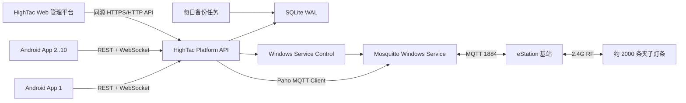
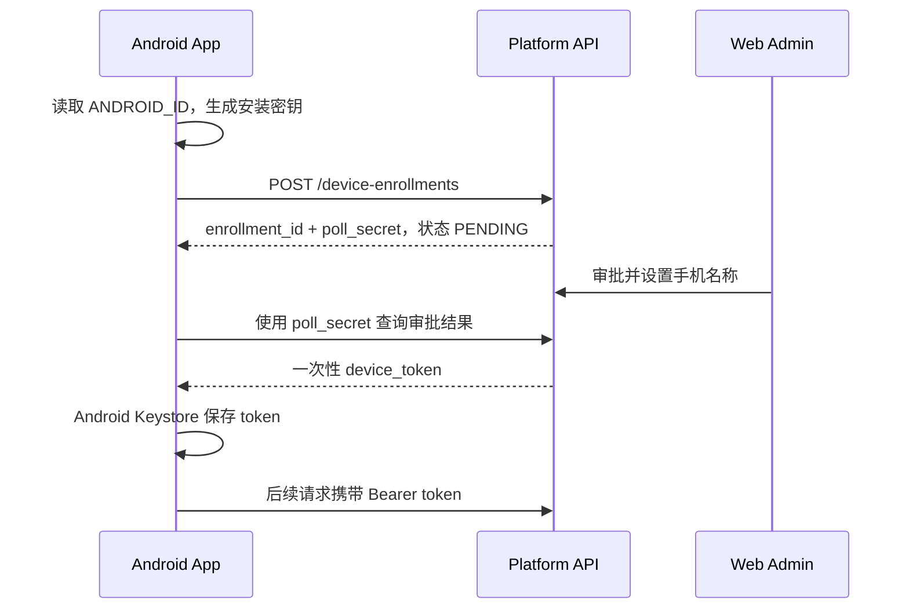

# HighTac AI 局域网管理平台架构设计与 Codex 落地方案

版本：2.0（V2.0.0 落地版）
日期：2026-07-18
适用仓库：`HighTacAI-Android-App`
目标环境：Windows 局域网边缘服务器 + 普通 Android 手机 + eStation 基站 + 夹子灯条

## 1. 文档目的

本文档把已确认的业务需求、Kaicom 管理平台的可借鉴部分、现有 Android/MQTT 代码和 Windows 部署工具整合为一份可直接交给 Codex 分阶段实施的技术方案。

本文不是对 Kaicom 网站的源码复制方案。HighTac 平台借鉴其信息架构和运营工作台模式，重新实现自有品牌、自有数据模型和自有服务端。

## 2. 已确认决策

| 决策项 | 结论 |
| --- | --- |
| 首版网络 | 仅局域网部署 |
| 首次部署 | 当前开发电脑测试 |
| 后续部署 | 迁移到其他长期在线的 Windows 电脑 |
| 现场规模 | 1 个站点、1 个基站、约 2000 条灯条、10 台 Android 手机并发使用 |
| MQTT Broker | Mosquitto Windows 服务，开机自启 |
| MQTT 管理 | 网页支持启动、停止、重启、状态检查和日志查看 |
| 数据主权 | Windows 后台数据库是唯一事实源 |
| Android MQTT | Android 不再直连 MQTT，由后台统一发布和订阅 |
| Android 登录 | 不需要人工账号登录 |
| Android 身份 | `ANDROID_ID` 哈希 + 安装设备密钥，不使用硬件 MAC |
| Android 离线策略 | 后台不可用时禁用绑定和亮灭灯，不回退 MQTT 直连 |
| 网页用户 | 首版只做一个管理员 |
| 初始管理员 | 用户名 `Adam`；安装器生成 32 位随机一次性密码，首次登录强制改密 |
| 产品来源 | 绑定时自动创建 + Excel 导入 |
| 绑定规则 | 一个产品可绑定多个灯条；一条灯条同一时间只能绑定一个产品 |
| 操作入口 | Android 和网页都可以新增绑定、解绑、亮灯、灭灯 |
| 数据库 | SQLite，WAL 模式 |
| 备份 | 每天自动备份，保留 30 天 |
| 操作记录 | 保留 1 年，可导出 CSV/Excel |
| 服务器网络 | 要求固定局域网 IPv4，安装向导生成配置 |
| 首版网页模块 | 仪表盘、MQTT 服务、基站、灯条、产品与绑定、亮灯/灭灯、操作记录、系统设置 |

## 3. Kaicom 平台分析结论

### 3.1 值得复用的产品模式

Kaicom 平台采用典型的现场设备管理后台结构：

- 固定左侧业务导航。
- 顶部面包屑、多页签、语言和用户入口。
- 每个模块使用“筛选条件 + 命令按钮 + 数据表 + 分页”。
- 首页集中显示账号、基站、灯条、低电量、异常和站点统计。
- 将站点、基站、灯条注册、灯条状态、绑定、任务和审计拆分成独立对象。
- 对亮灯、灭灯、解绑、导入、导出等动作保留操作记录。
- 区分基站在线状态、心跳时间、灯条最后在线、电量和异常状态。

### 3.2 Kaicom 页面中观察到的业务对象

| 业务域 | 主要对象/字段 |
| --- | --- |
| 首页 | 基站总数/在线/离线、灯条注册/发现、低电量、异常、站点统计 |
| 站点 | 名称、地址、备注、基站数量、灯条数量 |
| 基站 | SN、类型、别名、站点、状态、心跳、固件、绑定信息 |
| 灯条 | SN、电量、基站、站点、状态、注册时间、最后在线、运行数据 |
| 灯条注册 | SN、注册时间、最后在线、注册人、导入导出 |
| 绑定 | 物品码、灯条码、站点、绑定时间、来源、亮灯、灭灯、解绑 |
| 点亮任务 | 任务名称、站点、状态、创建/完成时间、执行人 |
| 操作记录 | 事件、灯条、查询码、操作人、来源、规则、时间 |
| 用户/角色 | 管理员、角色和权限 |

### 3.3 HighTac 首版明确不复制的模块

- 订单、套餐、续费和服务到期。
- 多租户、服务商和客户账号体系。
- 动态 APP 菜单和复杂角色权限。
- 可配置业务字段、数量记录和工单任务。
- Kaicom 的品牌资产、文案、图标和前后端实现。
- OTA、基站网络远程改写和公网运维。

## 4. 现有项目评估

### 4.1 可复用资产

- Android 已有 `StationConfig`、`LightBinding`、`LightStatus` 等领域模型。
- 已实现 eStation MQTT Topic、任务、心跳和回执解析。
- 已实现一个产品对应多灯条、一灯条只能绑定一个产品。
- 已实现亮灯、灭灯、批量任务、10 秒未确认和低电量展示。
- 已实现条形码扫描绑定。
- 已有 Mosquitto 启停、状态和 smoke test PowerShell 脚本。
- 已有 Windows MQTT 一键配置 Python GUI 和 PyInstaller 产物。
- 当前现场 Broker 地址为 `192.168.1.105:1884`，TLS 关闭。

### 4.2 必须改变的边界

- 当前绑定数据存在每台 Android 的 `SharedPreferences`，无法支持 10 台手机一致协作。
- 当前 Android 直接持有 MQTT 凭据并连接 Broker，无法形成统一审计和命令状态。
- 当前 Python GUI 内置的 `SimpleMqttBroker` 是手写的最小 MQTT 实现，不应作为正式生产 Broker。
- 当前没有服务端 API、统一数据库、设备身份、管理员认证和 WebSocket 事件通道。
- 当前 Windows MQTT 脚本面向开发人员，不是完整的可升级安装产品。

### 4.3 现有代码的处理原则

- 保留 MQTT 协议模型和单元测试，作为服务端协议实现的黄金参考。
- Android UI 和价格卡片继续复用，但数据访问改为后台 API。
- `SimpleMqttBroker` 只允许保留为开发演示工具，生产路径必须使用 Mosquitto。
- 现有未提交 Android 改动不得在平台搭建阶段被覆盖或回滚。

## 5. 目标系统架构



### 5.1 核心原则

1. 后台是唯一事实源，Android 和网页都是客户端。
2. 只有后台连接 MQTT，Android 不保存 Broker 密码。
3. 命令发布、结果匹配、超时和重试全部在后台统一处理。
4. 所有写操作必须可审计、可幂等、可追踪。
5. 服务端与 Broker 相互独立：停止 Broker 不应停止网页和 API。
6. 首版优化单机可靠性，不引入 Redis、消息队列或云数据库。
7. 所有模块保留多站点字段，但 UI 首版固定一个站点。

## 6. 技术选型

### 6.1 后端

| 项目 | 选型 |
| --- | --- |
| 语言 | Python 3.12 |
| Web 框架 | FastAPI |
| 数据模型 | Pydantic 2 |
| ORM | SQLAlchemy 2 |
| 数据迁移 | Alembic |
| 数据库 | SQLite 3，WAL + foreign_keys |
| MQTT | Eclipse Paho MQTT Python 2.x |
| Excel | openpyxl |
| 密码哈希 | Argon2id |
| 实时事件 | WebSocket |
| 测试 | pytest、pytest-asyncio、httpx |
| 打包 | PyInstaller one-folder |

### 6.2 网页

| 项目 | 选型 |
| --- | --- |
| 框架 | React + TypeScript + Vite |
| 组件库 | Ant Design |
| 服务端状态 | TanStack Query |
| 表格 | Ant Design Table；需要时使用 TanStack Table |
| 表单校验 | Zod |
| 图表 | Recharts |
| 测试 | Vitest + React Testing Library + Playwright |
| 部署 | 构建为静态资源，由 FastAPI 同源提供 |

### 6.3 Windows 服务与安装器

| 项目 | 选型 |
| --- | --- |
| Broker | 官方 Mosquitto Windows 版本 |
| 服务包装 | WinSW |
| API 服务名 | `HighTacPlatform` |
| Broker 服务名 | `HighTacMqttBroker` |
| 安装器 | Inno Setup |
| 默认 Web/API 端口 | `8088` |
| 默认 MQTT 端口 | `1884` |
| 数据目录 | `C:\ProgramData\HighTac\Platform` |
| 程序目录 | `C:\Program Files\HighTac\Platform` |

### 6.4 为什么不用复杂分布式组件

单站点、1 个基站、2000 条灯条和 10 个并发客户端远低于 SQLite、FastAPI 和 Mosquitto 的单机能力。首版加入 PostgreSQL、Redis、Kafka、Kubernetes 或微服务会提高安装、恢复和现场维护成本，没有业务收益。

## 7. 建议仓库结构

```text
HighTacAI-Android-App/
├─ app/                         # 现有 Android 应用
├─ server/
│  ├─ pyproject.toml
│  ├─ alembic.ini
│  ├─ migrations/
│  ├─ src/hightac_platform/
│  │  ├─ main.py
│  │  ├─ config.py
│  │  ├─ api/
│  │  ├─ auth/
│  │  ├─ db/
│  │  ├─ domain/
│  │  ├─ mqtt/
│  │  ├─ services/
│  │  ├─ imports/
│  │  ├─ backups/
│  │  └─ windows/
│  └─ tests/
├─ web/
│  ├─ package.json
│  ├─ vite.config.ts
│  ├─ src/
│  │  ├─ app/
│  │  ├─ api/
│  │  ├─ components/
│  │  ├─ features/
│  │  ├─ layouts/
│  │  └─ pages/
│  └─ tests/
├─ contracts/
│  ├─ openapi.yaml
│  ├─ events.schema.json
│  └─ mqtt-fixtures/
├─ installer/
│  ├─ windows/
│  ├─ winsw/
│  └─ licenses/
├─ tools/mqtt/                  # 现有开发脚本，逐步适配
└─ docs/
```

采用单仓库是为了让 Android、Web、API、MQTT fixtures 和安装器在一个 Git 版本中保持兼容。

## 8. Windows 部署拓扑

### 8.1 开发电脑测试配置

| 项目 | 值 |
| --- | --- |
| Wi-Fi | `Durova-5G` |
| Windows 固定 IP | `192.168.1.105/24` |
| 网关 | `192.168.1.1` |
| Web/API | `http://192.168.1.105:8088` |
| MQTT | `192.168.1.105:1884` |
| 基站 SN | `90A9F7301427` |
| TLS | 首版关闭 |

### 8.2 正式安装目录

```text
C:\Program Files\HighTac\Platform\
  server\
  web\
  mosquitto\
  service\

C:\ProgramData\HighTac\Platform\
  config\platform.yaml
  db\hightac.db
  backups\
  logs\platform.log
  logs\mosquitto.log
  mqtt\mosquitto.conf
  mqtt\passwordfile
  mqtt\aclfile
```

运行时日志、数据库、密码文件、PID 和备份不得提交 Git。

### 8.3 防火墙

- 仅为 Windows Private Profile 添加规则。
- `8088/TCP` 只允许 `LocalSubnet` 访问。
- `1884/TCP` 只允许 `LocalSubnet` 访问。
- 不开放数据库文件共享端口。
- 安装器需要管理员权限，日常网页不弹 UAC。

## 9. 服务职责

### 9.1 HighTacPlatform

- 提供网页静态资源和 `/api/v1`。
- 管理管理员会话和 Android 设备身份。
- 保存站点、基站、灯条、产品、绑定、命令和操作记录。
- 连接 Mosquitto，订阅基站心跳和结果。
- 发布亮灯、灭灯任务。
- 将实时状态通过 WebSocket 广播给网页和 Android。
- 执行每日备份、保留清理和 Excel 导入。
- 通过受控服务接口查询和控制 Mosquitto Windows 服务。

### 9.2 HighTacMqttBroker

- 只负责 MQTT 连接、订阅、发布、认证、ACL 和持久化。
- 不包含业务数据库和 HTTP API。
- 开机自启；异常退出由 Windows Service 自动重启。

### 9.3 Android App

- 通过 REST 获取绑定、状态和产品数据。
- 通过 REST 提交绑定、解绑、亮灯和灭灯命令。
- 通过 WebSocket 接收状态变化和命令结果。
- 本地只保留只读缓存和设备凭据，不作为绑定事实源。

## 10. 数据模型

数据库中的时间统一保存为 UTC epoch milliseconds；API 使用 RFC 3339 UTC 字符串。

### 10.1 `admin_users`

| 字段 | 说明 |
| --- | --- |
| `id` | UUID |
| `username` | 唯一，初始为 `Adam` |
| `password_hash` | Argon2id，不保存明文 |
| `must_change_password` | 正式安装首次登录必须改密码 |
| `is_active` | 是否启用 |
| `created_at_ms` | 创建时间 |
| `last_login_at_ms` | 最后登录 |

开发测试使用测试夹具动态生成的密码。正式安装器保留初始用户名 `Adam`，但每次安装生成独立的强随机一次性密码，并要求第一次登录立即修改。

### 10.2 `android_devices`

| 字段 | 说明 |
| --- | --- |
| `id` | UUID |
| `fingerprint_hash` | `ANDROID_ID`、签名摘要和固定命名空间的 SHA-256 |
| `token_hash` | 设备 Bearer Token 的哈希 |
| `display_name` | 管理员设置的手机名称 |
| `manufacturer/model` | 厂商和型号 |
| `app_version` | App 版本 |
| `status` | `PENDING/APPROVED/REVOKED` |
| `first_seen_at_ms` | 首次连接 |
| `last_seen_at_ms` | 最后在线 |

不要依赖硬件 MAC。Android 新版本对硬件 MAC 做了限制，Wi-Fi 随机 MAC 也可能变化。

### 10.3 `sites`

首版只有一条记录，但保留表结构：`id`、`name`、`address`、`notes`、`created_at_ms`。

### 10.4 `stations`

| 字段 | 说明 |
| --- | --- |
| `station_id` | 12 位基站 SN，主键 |
| `site_id` | 所属站点 |
| `alias` | 基站别名 |
| `status` | `UNKNOWN/ONLINE/STALE/OFFLINE` |
| `mac` | 心跳上报 MAC |
| `firmware_version` | 基站固件版本 |
| `server_address` | 基站心跳上报的 Broker 地址 |
| `heartbeat_seconds` | 基站心跳周期 |
| `last_heartbeat_at_ms` | 最后心跳 |
| `total_count/send_count` | 基站队列状态 |
| `created_at_ms/updated_at_ms` | 审计时间 |

在线规则：最后心跳不超过 `max(60 秒, Heartbeat * 3)` 为在线；超过阈值进入离线。API 与 MQTT 断开时必须区分“后台失联”和“基站离线”。

### 10.5 `light_tags`

| 字段 | 说明 |
| --- | --- |
| `tag_id` | `^AD1[0-9A-F]{9}$`，主键 |
| `site_id/station_id` | 最近所属站点和基站 |
| `registered_at_ms` | 首次登记 |
| `first_seen_at_ms` | 首次发现 |
| `last_seen_at_ms` | 最后回执/心跳 |
| `battery_raw/voltage/level` | 电池状态 |
| `firmware_version` | 灯条版本 |
| `group_no` | 基站分组 |
| `last_result_type` | 最近回执类型 |
| `is_abnormal` | 异常标志 |
| `abnormal_reason` | 异常原因 |

灯条状态和低电量是属性，不要做互斥单一枚举。例如一条灯可以同时是在线且低电量。

### 10.6 `products`

| 字段 | 说明 |
| --- | --- |
| `id` | UUID |
| `product_code` | 规范化后唯一；`trim + uppercase` |
| `product_name` | 可空，后续可补全 |
| `source` | `BINDING/EXCEL` |
| `is_active` | 是否启用 |
| `created_at_ms/updated_at_ms` | 审计时间 |

绑定时产品不存在则自动创建；名称为空也允许绑定。

### 10.7 `bindings`

| 字段 | 说明 |
| --- | --- |
| `id` | UUID |
| `product_id` | 产品 |
| `tag_id` | 灯条 |
| `site_id/station_id` | 站点和基站 |
| `source` | `ANDROID/WEB/MIGRATION` |
| `actor_type/actor_id` | 操作来源 |
| `bound_at_ms` | 绑定时间 |
| `unbound_at_ms` | 解绑时间，可空 |
| `is_active` | 当前是否有效 |

约束：

- 对 `tag_id WHERE is_active = 1` 建 SQLite partial unique index。
- 产品可以拥有任意数量的有效绑定。
- 解绑使用软删除，保留历史。
- 重绑必须是显式操作，不能静默覆盖原产品。

### 10.8 `commands` 与 `command_items`

`commands` 保存一次用户动作，`command_items` 保存每条灯的执行状态。

命令状态：

```text
ACCEPTED -> PUBLISHED -> CONFIRMED
                    -> PARTIALLY_CONFIRMED
                    -> UNCONFIRMED
         -> FAILED
         -> SUPERSEDED
```

每个 item 状态：`PENDING/PUBLISHED/CONFIRMED/UNCONFIRMED/FAILED/SUPERSEDED`。

### 10.9 `operation_logs`

操作日志只追加、不修改，至少包含：

- 事件类型。
- 站点、基站、灯条、产品和命令 ID。
- 操作者类型：`ADMIN/ANDROID/SYSTEM`。
- 操作者 ID 和显示名称。
- 请求摘要和结果摘要。
- 客户端 IP、设备型号和时间。
- 失败原因。

### 10.10 其他表

- `admin_sessions`：管理员会话和撤销。
- `device_enrollments`：Android 首次登记和审批。
- `import_jobs`、`import_job_rows`：Excel 导入预检和错误。
- `app_settings`：站点、颜色、阈值、保留策略等设置。
- `backup_records`：备份文件、大小、校验值和结果。

## 11. Android 设备身份和免登录流程



- 用户不输入账号密码。
- 新手机第一次接入后，管理员在网页“系统设置 > Android 设备”批准。
- 服务端只保存 Token 哈希。
- Token 被撤销后，App 立即失去写权限。
- App 卸载、清数据或换签名后需要重新审批。

## 12. 管理员认证

- 登录接口使用用户名和密码。
- 密码使用 Argon2id。
- 成功登录后使用 `HttpOnly + SameSite=Strict` 会话 Cookie。
- 所有 POST/PUT/PATCH/DELETE 使用 CSRF Token。
- 登录失败进行速率限制。
- 同源部署，不开放通配 CORS。
- 开发环境由测试夹具生成临时管理员密码，不在源码中保存固定密码。
- 正式安装首次登录强制修改密码。
- 启停 Broker、恢复备份和解绑必须二次确认并写操作日志。

## 13. API 设计

统一前缀：`/api/v1`。所有列表接口支持 `page`、`page_size`、`sort` 和条件过滤。

### 13.1 认证与健康

| 方法 | 路径 | 说明 |
| --- | --- | --- |
| POST | `/auth/login` | 管理员登录 |
| POST | `/auth/logout` | 登出 |
| GET | `/auth/me` | 当前管理员 |
| POST | `/auth/change-password` | 修改密码 |
| GET | `/health/live` | 进程存活 |
| GET | `/health/ready` | DB、MQTT 和迁移状态 |

### 13.2 仪表盘

| 方法 | 路径 | 说明 |
| --- | --- | --- |
| GET | `/dashboard/summary` | Broker、基站、灯条、绑定、设备和命令统计 |
| GET | `/dashboard/trends` | 最近 24 小时/7 天趋势 |

### 13.3 MQTT 服务

| 方法 | 路径 | 说明 |
| --- | --- | --- |
| GET | `/broker/status` | Windows 服务、TCP 和后台 MQTT 状态 |
| POST | `/broker/start` | 启动 Broker |
| POST | `/broker/stop` | 停止 Broker |
| POST | `/broker/restart` | 重启 Broker |
| GET | `/broker/logs?lines=200` | 有界读取最近日志 |
| GET | `/broker/config-summary` | 返回脱敏配置 |

服务控制接口返回 `202 Accepted`；最终状态通过 WebSocket 更新。日志接口禁止传入任意文件路径。

### 13.4 基站与灯条

| 方法 | 路径 | 说明 |
| --- | --- | --- |
| GET/POST | `/stations` | 查询和添加基站 |
| GET/PATCH | `/stations/{station_id}` | 详情和别名修改 |
| GET | `/stations/{station_id}/connection-checklist` | 生成接入清单 |
| GET | `/tags` | 灯条列表 |
| GET | `/tags/{tag_id}` | 灯条详情和历史 |
| POST | `/tags/register` | 手工登记灯条 |
| GET | `/tags/low-battery` | 低电量列表 |
| GET | `/tags/abnormal` | 异常列表 |

### 13.5 产品、导入和绑定

| 方法 | 路径 | 说明 |
| --- | --- | --- |
| GET/POST | `/products` | 产品列表和新增 |
| GET/PATCH | `/products/{id}` | 产品详情和修改 |
| GET | `/products/import-template` | 下载模板 |
| POST | `/products/imports` | 上传并预检 Excel |
| POST | `/products/imports/{id}/commit` | 全量校验后提交 |
| GET | `/bindings` | 按产品、灯条、来源查询 |
| POST | `/bindings` | 新建绑定，产品不存在时自动创建 |
| DELETE | `/bindings/{id}` | 软解绑 |
| POST | `/bindings/{id}/rebind` | 显式重绑 |

Excel 首版字段：`产品编码*`、`产品名称`。导入采用“先预检、展示错误、再整体提交”，不允许半批成功造成难以理解的数据状态。

### 13.6 亮灯和灭灯

| 方法 | 路径 | 说明 |
| --- | --- | --- |
| POST | `/light-commands` | 按产品或灯条创建命令 |
| GET | `/light-commands/{id}` | 查询命令状态 |
| POST | `/stations/{id}/all-off` | 当前站点全灭 |

请求示例：

```json
{
  "action": "LIGHT_ON",
  "product_code": "1711A-ABA-PT",
  "color": "RED",
  "idempotency_key": "client-generated-uuid"
}
```

服务端固定执行参数：蜂鸣开启、闪烁开启、时长 5 秒。颜色只允许 `RED/GREEN/BLUE/CYAN/PINK`。灭灯由服务端生成协议规定的 `Time=0` 指令。

### 13.7 Android 设备

| 方法 | 路径 | 说明 |
| --- | --- | --- |
| POST | `/device-enrollments` | 创建免登录登记 |
| GET | `/device-enrollments/{id}` | App 查询审批结果 |
| GET | `/android-devices` | 管理员查看设备 |
| POST | `/android-devices/{id}/approve` | 批准设备 |
| POST | `/android-devices/{id}/revoke` | 撤销设备 |
| POST | `/android-devices/{id}/rename` | 设置现场名称 |

### 13.8 操作记录、备份和设置

| 方法 | 路径 | 说明 |
| --- | --- | --- |
| GET | `/operation-logs` | 查询审计记录 |
| GET | `/operation-logs/export` | 导出 CSV/Excel |
| GET/PATCH | `/settings/site` | 单站点设置 |
| GET/PATCH | `/settings/network` | 服务地址与端口摘要 |
| GET | `/backups` | 备份列表 |
| POST | `/backups` | 立即备份 |
| POST | `/backups/{id}/restore` | 恢复前强制二次确认 |

### 13.9 WebSocket

路径：`/api/v1/ws/events`。

事件类型：

- `broker.status_changed`
- `station.status_changed`
- `station.heartbeat`
- `tag.status_changed`
- `binding.created`
- `binding.removed`
- `command.status_changed`
- `device.status_changed`
- `system.notice`

所有事件包含 `event_id`、`event_type`、`occurred_at`、`entity_id` 和 `payload`。客户端断线重连后必须先拉一次 REST 快照，不能假设 WebSocket 补齐所有历史事件。

## 14. MQTT Bridge 设计

### 14.1 Topic

后台订阅：

- `/estation/+/heartbeat`
- `/estation/+/result`
- `$SYS/broker/clients/connected`
- `$SYS/broker/uptime`

后台发布：

- `/estation/{SN}/task`
- 未来可选 `/estation/{SN}/bind`
- 未来可选 `/estation/{SN}/group`

首版不实现 OTA。

### 14.2 MQTT 账号和 ACL

建议使用两个账号：

- `hightac_backend`：后台读写 `/estation/#`，读取必要 `$SYS/#`。
- `estation_90A9F7301427`：只读自己的 task/bind/group，写自己的 heartbeat/result。

当前现场可先兼容已有 MQTT 用户名和受保护配置中的密码，待平台稳定后在计划停机窗口重新配置基站并分离账号。任何 MQTT 密码都不得写入文档或提交 Git。

### 14.3 Mosquitto 生产配置

```conf
listener 1884 0.0.0.0
protocol mqtt
allow_anonymous false
password_file C:/ProgramData/HighTac/Platform/mqtt/passwordfile
acl_file C:/ProgramData/HighTac/Platform/mqtt/aclfile
persistence true
persistence_location C:/ProgramData/HighTac/Platform/mqtt/data/
autosave_interval 60
log_dest file C:/ProgramData/HighTac/Platform/logs/mosquitto.log
connection_messages true
```

首版 MQTT TLS 关闭，但端口只能暴露在可信局域网和 Windows Private Profile。

### 14.4 命令调度算法

1. API 校验设备权限、产品、绑定和基站在线状态。
2. 使用 `idempotency_key` 防止手机连点和网络重试生成重复命令。
3. 产品编码解析为该产品所有有效灯条。
4. 灯条按每包最多 20 个分批。
5. 后台立即发布 QoS 0、`retain=false`，保持与当前基站验证路径兼容。
6. 发布成功只标记 `PUBLISHED`，不能显示“灯条已执行”。
7. 2 秒未收到对应灯条回执时允许重发一次幂等亮灭灯指令。
8. 10 秒仍无回执的 item 标记 `UNCONFIRMED`。
9. 批次中全部确认才标记 `CONFIRMED`；部分确认标记 `PARTIALLY_CONFIRMED`。
10. 同一灯条收到更新命令时采用 last-write-wins，旧命令标记 `SUPERSEDED`，避免用户等待旧命令队列。

### 14.5 回执关联限制

eStation 回执没有 HighTac 命令 ID。服务端只能按以下条件关联：

- 相同基站。
- 相同灯条 ID。
- 回执到达时间处于命令 10 秒窗口。
- 回执颜色/状态与期望操作一致时优先匹配。
- 同一灯条只允许存在一个“最新有效待确认命令”。

因此 UI 必须使用“已下发、已确认、部分确认、未确认”，不能把 MQTT publish 当作执行成功。

## 15. Broker 服务控制

### 15.1 状态机

```text
STOPPED -> STARTING -> RUNNING -> STOPPING -> STOPPED
                  \-> FAILED
```

状态检查必须组合三层信号：

1. Windows Service Control Manager 状态。
2. `127.0.0.1:1884` TCP 探测。
3. 后台 Paho MQTT Client 是否连接和订阅成功。

### 15.2 控制要求

- 启动、停止和重启最大等待 15 秒。
- 重复点击必须幂等。
- 页面按钮根据状态禁用，避免并发控制。
- 停止前显示“基站和所有 App 将无法亮灭灯”的确认提示。
- 所有操作写入审计日志。
- 日志查看只返回最后 50/200/500 行，过滤密码。
- Broker 停止后网页仍可访问，仪表盘显示红色故障状态。

### 15.3 Windows 权限

首版可让 `HighTacPlatform` 服务以 LocalSystem 运行，以便管理 `HighTacMqttBroker`。风险通过以下方式控制：

- API 仅绑定配置的局域网接口。
- 防火墙限制 LocalSubnet。
- 服务控制接口只允许已登录管理员。
- 不提供任意命令执行、任意路径和任意服务名参数。
- Broker 服务名在代码中固定。

后续若进入多站点正式商用，再拆分为低权限 API 服务和最小权限 Broker Agent。

## 16. Android 改造方案

### 16.1 新增模块

- `PlatformConfigStore`：保存 API 地址和设备 Token。
- `HighTacPlatformApi`：使用现有 OkHttp 风格访问 REST。
- `PlatformEventClient`：OkHttp WebSocket，指数退避重连。
- `RemoteLightBindingRepository`：服务端绑定事实源。
- `RemoteLightCommandRepository`：提交命令和查询状态。
- `DeviceEnrollmentManager`：免登录设备登记。
- `PlatformCache`：只读本地缓存，建议使用 Room。

### 16.2 UI 改造

- 原“MQTT 配置”改为“服务器配置”。
- 用户填写 `http://服务器固定IP:8088`。
- App 显示后台、Broker 和基站三个独立状态。
- 未审批手机显示“等待管理员批准”。
- 后台不可用时：允许查看最后缓存，但禁用绑定、解绑、亮灯和灭灯。
- 查价卡片的亮灯/灭灯继续停留当前页面，只通过远程命令执行。
- 是否显示亮灭灯按钮由服务端绑定缓存决定。
- 扫描灯条仍只接受一维条形码。

### 16.3 删除或降级的职责

- `EStationMqttClient` 不再由生产 UI 使用。
- Android 不再保存 MQTT 用户名和密码。
- `StationConfigStore` 迁移后只保留兼容读取，最终删除。
- `SharedPreferencesLightBindingRepository` 只用于一次性数据迁移，不再接受新写入。
- 不实现服务器不可用时的 MQTT 自动兜底。

### 16.4 本地缓存不是事实源

Room 可以缓存产品、绑定、灯条状态和最后同步时间，以提升查价卡片判断速度。所有写操作必须先到服务端；服务端确认后才更新本地缓存。离线缓存只能展示，并明确标记最后同步时间。

## 17. 旧绑定数据迁移

升级 App 后执行一次迁移：

1. 管理员先部署后台并添加基站。
2. 每台旧手机配置 API 地址并完成设备审批。
3. App 读取本机旧 `SharedPreferences` 绑定。
4. App 调用 `/migrations/android-bindings/preview`。
5. 服务端返回新增、重复和冲突列表。
6. 完全相同的产品-灯条绑定自动去重。
7. 同一灯条绑定不同产品时不自动覆盖，进入管理员冲突处理。
8. 管理员确认后提交迁移。
9. App 标记迁移完成，后续只读服务端。

不能简单按照最后更新时间覆盖，因为不同手机时钟可能不一致。

## 18. Web 信息架构

### 18.1 导航

```text
仪表盘
MQTT 服务
基站管理
灯条管理
  全部灯条
  低电量
  异常灯条
产品与绑定
  产品
  绑定关系
操作记录
系统设置
  站点与网络
  Android 设备
  备份与恢复
  管理员安全
```

### 18.2 页面设计原则

- 借鉴 Kaicom 的深色左侧导航、白色顶部栏、面包屑和密集表格。
- 使用 HighTac 品牌、文案和图标，不复制 Kaicom Logo 或素材。
- 页面是运营工具，不制作营销型首页。
- 主要内容采用筛选区、工具栏、表格和抽屉详情。
- 危险动作使用红色文字/按钮和确认对话框。
- 卡片圆角不超过 8px，不做卡片嵌套。
- 状态颜色：绿色在线、黄色待确认/低电量、红色离线/异常、蓝色运行中。
- 表格支持 20/50/100 条分页，2000 条灯条始终使用服务端分页。
- 桌面优先，最低支持 1280px；平板只保证查询和查看，管理操作以桌面为主。

### 18.3 仪表盘

首屏显示：

- API 服务状态。
- MQTT Windows 服务状态和运行时长。
- Broker 端点和后台 MQTT 连接状态。
- 基站在线/离线和最后心跳。
- 灯条总数、24 小时发现数、低电量数、异常数。
- 产品数、有效绑定数、未绑定灯条数。
- 最近 24 小时命令数、确认率和未确认数。
- 已审批/在线 Android 设备数。
- 最近异常和最近操作。

### 18.4 MQTT 服务页

- 运行状态、服务名、端点、进程启动时间。
- 启动、停止、重启按钮。
- TCP 探测、后台 MQTT 连接和基站心跳三层检查。
- 最近日志，支持暂停自动滚动和复制。
- 脱敏显示用户名，不显示密码明文。

### 18.5 产品与绑定页

- 按产品编码、产品名称、灯条 ID 和绑定来源查询。
- 产品详情显示所有已绑定灯条和状态。
- 单产品一键亮灯/灭灯，后台按最多 20 条分批。
- 支持绑定、解绑和显式重绑。
- 支持 Excel 模板、预检、错误下载和提交。
- USB 条码枪输入按键盘输入处理，不要求网页调用摄像头。

## 19. 备份、恢复和保留

### 19.1 自动备份

- 每天 02:00 使用 SQLite Online Backup API 创建一致性备份。
- 备份文件名包含 UTC 时间和 schema version。
- 计算 SHA-256 并记录大小。
- 保留最近 30 天；清理只删除系统识别的备份目录内文件。
- 备份失败在仪表盘显示告警并写日志。

### 19.2 恢复

- 只有管理员可恢复。
- 恢复前自动创建“恢复前备份”。
- 暂停写入和 MQTT 命令调度。
- 校验数据库和 schema version。
- 恢复后重启 API 服务并执行健康检查。

### 19.3 保留策略

- 操作日志：365 天。
- 命令和 item 状态：365 天。
- 原始 MQTT payload：默认 30 天，只保存有诊断价值的 payload。
- 服务文本日志：按 20 MB 滚动，最多 10 个文件。
- 备份：30 天。

## 20. 可观测性

### 20.1 结构化日志

字段至少包含：`timestamp`、`level`、`event`、`request_id`、`command_id`、`station_id`、`tag_id`、`device_id`、`duration_ms`。

不得记录：

- 管理员密码。
- Android Bearer Token。
- MQTT 明文密码。
- 完整 Cookie。

### 20.2 健康指标

- API ready/live。
- DB WAL 状态和最后备份。
- Broker Windows 服务/TCP/MQTT 三层状态。
- MQTT 重连次数。
- 基站心跳延迟。
- 命令 publish 延迟、确认率、未确认数。
- WebSocket 在线客户端数量。

## 21. 安装器流程

1. 检查 Windows 版本和管理员权限。
2. 选择或检测局域网网卡和 IPv4。
3. 检查是否为固定 IP；若不是，给出明确阻断提示或配置向导。
4. 配置 Web 端口、MQTT 端口、站点名和基站 SN。
5. 生成 MQTT 后台账号、基站账号、密码文件和 ACL。
6. 安装 Mosquitto、`HighTacMqttBroker` 和 `HighTacPlatform` 服务。
7. 添加 Private Profile 防火墙规则。
8. 初始化 SQLite 和 Alembic schema。
9. 初始化管理员 `Adam` 和安装时生成的一次性强随机密码，标记首次登录改密码。
10. 启动服务并执行健康检查。
11. 输出 Web 地址、基站 MQTT 配置和 Android API 地址。
12. 生成卸载器；卸载默认保留 `ProgramData` 数据并询问是否删除。

安装器升级不得覆盖数据库、配置、密码文件和备份。

## 22. 测试策略

### 22.1 后端单元测试

- 产品编码、SN 和灯条 ID 规范化。
- 一产品多灯和灯条唯一绑定约束。
- 幂等键和重复请求。
- 命令状态机、批量 20 条、重试和 10 秒未确认。
- 心跳在线阈值和低电量算法。
- 管理员认证、CSRF、设备 Token 和撤销。
- Excel 预检和全量提交。
- 备份保留和路径安全。

### 22.2 MQTT 集成测试

- 使用真实 Mosquitto 测试账号、ACL、订阅和发布。
- 使用模拟 eStation Client 发布 heartbeat/result。
- 验证 Broker 重启后后台自动重连和重新订阅。
- 验证错误 SN、错误 Topic、非法 JSON 不污染数据库。
- `contracts/mqtt-fixtures` 同时供 Kotlin 与 Python 测试使用。

### 22.3 Web 测试

- 登录、路由和权限保护。
- Broker 启停状态和危险确认。
- 灯条筛选、分页、低电量和异常。
- 产品导入预检。
- 绑定、解绑、亮灯和灭灯。
- WebSocket 断线重连和 REST 快照恢复。
- Playwright 在 1440x900 和 1920x1080 检查无溢出、遮挡和空白页。

### 22.4 Android 测试

- 设备登记、审批、Token 保存和撤销。
- API 失败时禁用写操作。
- WebSocket 重连和缓存刷新。
- 查价卡片不跳转执行亮灭灯。
- 一个产品多灯条批量动作。
- 条形码扫描格式限制。
- 旧绑定迁移和冲突预览。
- 按 AGENTS.md 使用 Java 21 运行 Gradle 测试。

### 22.5 真机验收

- Windows 服务器、真实基站、真实灯条和至少 2 台 Android 联调。
- 再扩展到 10 台 Android 并发 smoke test。
- 拔掉基站电源、停止 Broker、关闭后台、断开 Wi-Fi 分别验证错误状态。
- 真机操作记录必须与命令状态一致。

## 23. 性能目标

| 指标 | 目标 |
| --- | --- |
| 普通 API p95 | 局域网内小于 300 ms |
| 命令接受到 MQTT publish p95 | 小于 500 ms |
| 收到 MQTT 回执到 WebSocket 推送 p95 | 小于 300 ms |
| 2000 灯条分页查询 p95 | 小于 500 ms |
| 10 台 Android 并发 | 无重复绑定、无数据库锁错误 |
| 后台重启恢复 | 30 秒内 ready |
| Broker 重启恢复订阅 | 30 秒内 |
| 备份 | 不阻断正常查询，失败可见 |

硬件 RF 延迟不计入 API 指标；回执超过 10 秒按未确认处理。

## 24. 分阶段 Codex 执行计划

每个阶段单独创建 `codex/` 分支、独立提交，并在进入下一阶段前通过质量门禁。

### M0：合同和骨架

交付：

- 创建 `server/`、`web/`、`contracts/`、`installer/` 目录。
- 编写 `openapi.yaml` 初版和 WebSocket event schema。
- 提取 Kotlin MQTT 测试 payload 到 `contracts/mqtt-fixtures`。
- 创建 ADR：中央后台、SQLite、Mosquitto 服务、Android 身份。
- 加入运行时文件 `.gitignore`。

门禁：OpenAPI 可解析；Android 现有测试仍通过；没有提交密码和运行时数据。

建议提交：`chore: scaffold HighTac local platform contracts`

### M1：后台基础和认证

交付：

- FastAPI 项目、配置加载、日志、request ID。
- SQLAlchemy、SQLite WAL 和 Alembic 初始迁移。
- 随机一次性管理员密码初始化、登录、登出、强制改密码、CSRF。
- Android enrollment、审批、Token 验证。
- health/live/ready。

门禁：pytest 全部通过；密码和 Token 均只保存哈希；API contract test 通过。

建议提交：`feat: add platform API foundation and device identity`

### M2：Mosquitto 服务和 MQTT Bridge

交付：

- `BrokerSupervisor` 抽象和 Windows SCM 实现。
- Broker 状态、启停、重启和日志 API。
- Paho MQTT Bridge、自动重连和订阅。
- heartbeat/result Python 解析和黄金 fixture 测试。
- station/tag 状态入库和 WebSocket 事件。

门禁：真实 Mosquitto 集成测试；Broker 重启自动恢复；非法 payload 不导致进程退出。

建议提交：`feat: manage Mosquitto and ingest eStation telemetry`

### M3：产品、绑定、命令和审计

交付：

- 产品、灯条、绑定、命令、操作日志 API。
- SQLite partial unique index。
- Excel 模板、预检、错误和提交。
- 命令幂等、20 条分批、一次重试、10 秒未确认。
- 产品批量亮灯/灭灯和站点全灭。

门禁：并发绑定测试、命令状态机测试、2000 灯条数据性能测试。

建议提交：`feat: centralize products bindings and light commands`

### M4：Web 管理平台

交付：

- HighTac 品牌登录页和运营后台布局。
- 仪表盘、MQTT、基站、灯条、产品与绑定、日志、设置页面。
- WebSocket 实时状态。
- Android 设备审批和撤销。
- 备份页面和管理员密码修改。

门禁：Vitest、Playwright、桌面截图和响应式检查通过；危险操作有确认。

建议提交：`feat: add HighTac LAN management console`

### M5：Android 切换中央后台

交付：

- 服务器配置和免登录设备登记。
- REST/WebSocket Client。
- Room 只读缓存。
- `LightFindingViewModel` 和查价卡片切到远程 repository。
- 后台不可用时禁用写操作。
- 旧绑定迁移预览和冲突处理。
- 生产 UI 移除 MQTT 直连路径和 Broker 凭据。

门禁：Android 单元测试、Debug 构建、USB 真机安装；两台手机看到相同绑定。

建议提交：`feat: move Android light finding to platform API`

### M6：Windows 安装器和运维

交付：

- Web build 嵌入后端。
- PyInstaller one-folder。
- Mosquitto、WinSW 和 Inno Setup。
- 固定 IP 检查、防火墙、服务注册和配置生成。
- 自动备份、恢复、日志滚动。
- 升级和卸载保留数据策略。

门禁：在一台干净 Windows 电脑完成安装、重启、升级和卸载演练。

建议提交：`feat: package HighTac platform for Windows deployment`

### M7：现场验收和发布

交付：

- 真实基站、2000 条规模数据和 10 手机并发测试。
- 故障注入、备份恢复和性能报告。
- 运维手册、安装手册、基站配置单和 Android 接入说明。
- 版本标签和 GitHub Release。

门禁：第 25 节验收项全部通过，无 P0/P1 缺陷。

## 25. 验收标准

### 25.1 安装与服务

- Windows 重启后 API 和 Mosquitto 自动运行。
- 网页可查看并控制 Broker；停止 Broker 不影响网页访问。
- 其他局域网电脑能访问网页，公网无法访问。
- 安装器输出正确 Web、MQTT、基站和 App 配置。

### 25.2 中央数据

- 两台手机绑定后，网页和其他手机 2 秒内看到同一结果。
- 同一灯条不能被两个产品同时绑定。
- 一个产品可以绑定多条灯。
- 解绑保留历史记录。
- 旧手机迁移冲突不会被静默覆盖。

### 25.3 亮灯与灭灯

- 产品亮灯会向全部有效绑定灯条分批发布。
- 固定蜂鸣开启、闪烁开启、5 秒时长。
- 已发布、已确认、部分确认和未确认状态准确区分。
- 10 秒无回执显示未确认。
- App 在查价页执行亮灭灯时不跳转页面。

### 25.4 状态和故障

- 基站心跳 30 秒内反映到网页和 App。
- 超过心跳阈值显示基站离线。
- Broker 停止、API 停止和基站离线显示不同原因。
- App 无后台时不尝试 MQTT 直连，也不允许写操作。
- 低电量和异常灯条可筛选。

### 25.5 安全和审计

- 未登录网页不能控制 Broker 或改数据。
- 未审批/已撤销 Android 不能写数据。
- 密码、Token、MQTT 密码不出现在日志和 Git。
- 每次绑定、解绑、亮灯、灭灯、Broker 控制和恢复备份都有审计记录。

### 25.6 备份

- 自动备份每天生成，超过 30 天自动清理。
- 备份可验证并恢复。
- 恢复前自动创建恢复前备份。
- 操作记录可导出。

## 26. 风险与控制

| 风险 | 控制措施 |
| --- | --- |
| Windows 电脑关机导致全站不可用 | 常开服务器、开机自启、UPS 建议、健康状态明显展示 |
| 固定 IP 冲突或 Wi-Fi 切换 | DHCP 池避让、安装器检查、网络变更向导 |
| MQTT 明文 | 仅可信局域网、防火墙 LocalSubnet，后续 TLS/VPN |
| 回执无命令 ID | 每灯最新命令关联、幂等键、明确未确认语义 |
| 多手机重复操作 | 中央唯一约束、事务、幂等键和审计 |
| SQLite 写锁 | WAL、短事务、单进程写入、busy_timeout |
| 初始弱密码 | 正式安装首次登录强制改密码 |
| 手写 Broker 协议不完整 | 生产改用官方 Mosquitto |
| Android 硬件 MAC 不可用 | ANDROID_ID 哈希 + Keystore 设备 Token |
| 迁移数据冲突 | 预检、人工确认、不按手机时间静默覆盖 |

## 27. Codex 执行约束

Codex 实施每个 Milestone 时必须遵守：

1. 先读取根目录 `AGENTS.md`，Android 构建使用指定 Java 21。
2. 开工前执行 `git status --short --branch`，保留用户无关改动。
3. 每个 Milestone 独立 `codex/` 分支，不跨阶段混合提交。
4. 手工编辑使用 `apply_patch`。
5. 不提交 `ProgramData`、数据库、日志、密码文件、Token、PID、备份和构建目录。
6. MQTT 核心使用 Mosquitto/Paho，不扩展手写 `SimpleMqttBroker` 作为生产实现。
7. API 先更新 `contracts/openapi.yaml`，再实现后端、Web 和 Android。
8. 所有数据库变更使用 Alembic，不在启动代码中临时改表。
9. 所有写 API 支持事务；命令和绑定支持幂等。
10. 完成后运行该 Milestone 全部测试，并汇报未运行项。
11. Web 必须用 Playwright 检查 1440x900 和 1920x1080。
12. Android Milestone 必须构建并安装到 USB 真机验证。
13. 每个 Milestone 完成后先提交本地 Git，再由用户决定是否推送。

## 28. Codex 首轮执行提示词

下面的提示词用于正式启动 M0，不要直接跳到完整平台实现：

```text
请读取 AGENTS.md 和 docs/hightac-web-platform-architecture-plan.md，执行 M0：合同和骨架。

要求：
1. 检查当前 Git 分支和未提交改动，不覆盖现有 Android 改动，也不要处理无关的 DesktopFileOrganizer 文件。
2. 创建 server、web、contracts、installer 的最小目录骨架，但不要在 M0 实现业务页面或 Windows 服务。
3. 根据架构文档创建 contracts/openapi.yaml、contracts/events.schema.json 和 ADR 文档。
4. 将现有 Kotlin eStation 协议测试中的典型 JSON 提取为 contracts/mqtt-fixtures，并调整 Kotlin 测试复用这些 fixture。
5. 更新 .gitignore，确保数据库、日志、密码、Token、PID、备份、Python/Node 构建产物不会提交。
6. 运行 Android 单元测试、OpenAPI 校验和 JSON Schema 校验。
7. 汇报文件、架构决策、验证结果和下一步，不开始 M1。
```

## 29. 最终定义

HighTac 网页平台不是 Android App 的“镜像页面”，而是现场系统的控制平面：

- Windows 平台管理服务、数据、身份和审计。
- Mosquitto 管理消息传输。
- 基站负责 RF 通信。
- Android 和网页负责业务操作。
- 所有客户端看到同一份绑定和状态。

按照本文的 M0-M7 顺序执行，可以在不破坏现有 Android 功能的前提下，把当前单手机 MQTT 工具逐步升级为可部署、可运维、可多手机协作的局域网管理平台。
