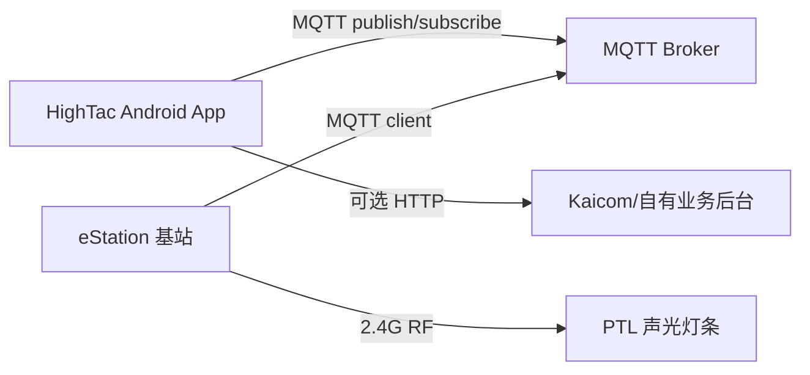

# HighTac AI 声光灯条寻物大版本需求分析

日期：2026-07-08

分支：`codex/light-finding-requirements`

## 1. 背景与目标

HighTac AI 当前是一个 Kotlin + Jetpack Compose Android 应用，主功能是摩托车配件 AI 咨询、图片咨询和价格查询。新大版本目标是把 App 从“查询/问答工具”升级为“软硬件协同找件工具”：现场人员可在档口或仓库中通过物料码、灯条码、任务清单等方式快速定位实物，App 负责业务输入、灯条绑定、声光指令下发、状态回执展示和异常提示。

目标硬件系统为 eStation 基站 + PTL 声光灯条。基站作为 MQTT client 连接 MQTT broker，App 也作为 MQTT client 连接同一 broker，通过 `/estation/{ID}/...` 主题与基站异步通信。

本阶段需求分析基于以下资料：

- 在线 MQTT 二开文档：`https://platform.kaicom.cn:9006/platform/file-server/eStationMqtt.html`
- App 下载页：`https://platform.kaicom.cn:9600/downloadApp.html`
- 网页后台入口：`https://platform.kaicom.cn:9600/login`
- 基站配置说明：`C:\Users\ooo\Desktop\声光寻物系统\基站使用配置说明V1.0(6).pdf`
- APP 使用说明：`C:\Users\ooo\Desktop\声光寻物系统\萤光寻物APP2.0使用手册-(正式版).pdf`
- APK：`C:\Users\ooo\Desktop\声光寻物系统\a6ee1232-5a4a-48fa-a8ab-2235368e1dc2 (1).apk`
- 逆向产物：`C:\Users\ooo\Desktop\声光寻物系统\reverse_output`
- 当前 HighTac Android 仓库：`C:\0.Files\Program\HighTacAI-Android-App`

说明：未登录网页后台，后台能力仅依据手册和 APK 逆向接口推断；不能把逆向产物视作可直接复制的源码。

逆向资料可信度分层：

- 高可信：手册流程、HTTP 路径、Base URL、Manifest 权限、MMKV key、首页菜单映射等，有手册与源码交叉印证。
- 中可信：具体 ViewModel 内部状态流、部分 DTO 字段含义，源码被混淆但调用关系清楚。
- 低可信：后端完整错误码、平台 SLA、真实生产权限、服务到期策略细节；未登录后台实测，且 JADX 摘要显示存在局部反编译失败。

## 2. 当前 HighTac App 基线

### 2.1 已有能力

当前工程结构较轻，主要文件线索：

- `app/src/main/java/com/example/deepchatdemo/MainActivity.kt`：单 Activity Compose 入口，启动页后进入 `DeepChatScreen`。
- `app/src/main/java/com/example/deepchatdemo/ui/DeepChatScreen.kt`：当前有两个模式：AI 顾问和价格查询，且文件体量已很大；声光寻物不应继续堆入同一个文件。
- `app/src/main/java/com/example/deepchatdemo/chat/*`：OpenAI Responses API、配件知识检索、图片咨询。
- `app/src/main/java/com/example/deepchatdemo/price/*`：简道云价格查询、本地缓存、筛选 UI。
- `app/build.gradle.kts`：已启用 Compose、BuildConfig、OkHttp、Coroutines、Coil；未引入 MQTT、数据库、扫码、依赖注入、加密存储等能力。
- `app/src/main/AndroidManifest.xml`：目前只有 `INTERNET` 权限和 `FileProvider`。

### 2.2 主要缺口

- 无 MQTT client 能力：缺连接、订阅、发布、重连、消息解析、前后台生命周期管理。
- 无灯条/基站数据模型：缺 `StationConfig`、`LightTag`、`LightBinding`、`TaskResult`、`EstationInfo` 等领域对象。
- 无条码扫描工作流：已有拍照/图库，不等于扫码；后续需要 CameraX/ML Kit 或适配手持机扫码广播/SDK。
- 无站点/账号/后台业务体系：当前 App 不具备萤光 App 的登录、站点、绑定查询、任务、操作记录等平台能力。
- 无本地持久化层：价格缓存是文件级用途，寻物系统需要保存基站、灯条绑定、操作历史、最近心跳等结构化数据。
- 现有 UI 是偏“AI 工具”的全屏对话体验；寻物模块需要更高密度、可扫可操作、状态明确的现场工作台。

## 3. 目标系统边界

### 3.1 推荐系统形态

第一阶段建议走“HighTac App 直连 MQTT broker 控制基站”的路径：



原因：

- 二开文档已经给出完整 MQTT 协议，足以实现点亮、灭灯、心跳、回执、分组、群控。
- 当前 HighTac App 没有萤光平台账号/站点体系，若第一阶段强依赖平台 HTTP，会显著增加登录、权限、站点、后台配置等前置成本。
- 逆向 APK 中存在 `com.kaicom.android.sdk.lightctrl` 本地 USB/SDK 控制能力，但这是另一条硬件路径，涉及 native `.so`、PDA 设备适配和授权边界，不建议作为第一阶段主路径。

### 3.2 已确认的第一版约束

基于 2026-07-08 的需求确认，第一版范围收敛如下：

- 不做 Kaicom 平台账号登录，不做租户、服务到期、员工权限等平台前置流程。
- MQTT broker 初期由现场笔记本电脑搭建，App 与基站连接同一 broker。
- 第一版默认明文 TCP + 用户名密码，不要求 TLS；若后续进入跨公网或客户生产网络，再升级 TLS/VPN/内网隔离策略。
- 现场设备是普通 Android 手机，不依赖 Kaicom PDA、USB 控制器或私有扫码 SDK。
- 灯条类型只有夹子灯条，`Time` 按夹子灯条上限 36 档、180 秒处理。
- 物料码/产品编码与灯条 ID 的初始数据通过 App 手动扫码绑定。
- 价格查询模块的配件卡片需要集成“扫码绑定灯条”入口；已绑定时显示“亮灯/灭灯”按钮，未绑定时不显示亮灯/灭灯按钮。
- 有实物基站和灯条用于开发验收，Milestone 0 需要尽快做真机 MQTT smoke test。

### 3.3 分期范围

**MVP：硬件直连寻物**

- 配置 MQTT broker 和基站 SN。
- 订阅基站心跳和灯条回执。
- 手动维护或导入物料码与灯条 ID 绑定。
- 扫描/输入物料码，点亮对应灯条。
- 支持单灯、多灯批量点亮、灭灯、基础颜色/蜂鸣/闪烁/时长设置。
- 显示回执、超时、低电量、基站在线状态。

**V2：现场业务闭环**

- 灯条绑定/解绑工作流。
- 绑定查询、操作记录、本地或自有后台同步。
- 货架灯联动、找件后解绑开关、模糊查询、语音播报。
- 批量任务，默认每批 20 个灯。

**V3：平台/后台增强**

- 可选对接 Kaicom 平台或自建后台的登录、站点、任务、日志、灯条管理接口；当前第一版明确不做登录。
- 多站点、多账号、权限、服务到期控制。
- 网页后台导入任务和绑定数据。
- OTA 和高级基站运维。

## 4. MQTT 协议需求

### 4.1 基础规则

- 所有 Topic 遵循 `/estation/{ID}/...`。
- 基站 ID：`^90A9F[0-9A-F]{7}$`，总长 12 位，必须大写校验。
- 灯条 ID：`^AD1[0-9A-F]{9}$`，总长 12 位，必须大写校验。
- 基站是 MQTT client；App 也是 MQTT client；两者通过 broker 异步通信。
- 文档示例未强制 QoS，MVP 可按 QoS 0、`retain=false`、`cleanSession=true` 起步；封装层要预留 QoS 配置。QoS 0 是“最多一次”，可能丢消息，App 不能把“已发布”误显示为“已执行”。
- 灯条在基站 2.4G 覆盖范围内才能通信，灯条绝缘片必须拔掉。
- MQTT Topic 大小写敏感，前导 `/` 是 Topic 的一部分，发布 Topic 不使用通配符。

### 4.2 App 需要订阅的 Topic

**`/estation/{ID}/result`**

用途：接收基站与灯条通信后的结果，包括亮灯、灭灯、按键、灯条心跳。

Payload：`TaskResult`

关键字段：

| 字段 | 类型 | 需求 |
| --- | --- | --- |
| `ID` | String | 基站 SN，必须匹配当前基站 |
| `TotalCount` | Int | 基站缓存中的任务总数 |
| `SendCount` | Int | RF 模块待发送任务数 |
| `Results` | List | 灯条结果列表 |

`Results[]` 字段：

| 字段 | 类型 | 需求 |
| --- | --- | --- |
| `TagID` | String | 灯条 ID，必须校验 `AD1...` |
| `Version` | String | 灯条固件版本 |
| `ResultType` | Int | `253/0xFD` 按键，`254/0xFE` 通信，`255/0xFF` 心跳 |
| `RfPowerSend` | Int | AP 方 RF 功率，`-256` 表示无数据，不作为距离依据 |
| `RfPowerRecv` | Int | 灯条侧 RF 功率，`-256` 表示无数据，不作为距离依据 |
| `Battery` | Int | 电压值需除以 10，`30` = 3.0V |
| `Colors` | List | RGB 状态 |
| `Group` | Int | 分组号，基站固件 v1.6.7+ 支持 |
| `Sequence` | Int? | 示例中存在，模型需兼容可选字段 |

电量等级：

| 电压 | 等级 |
| --- | --- |
| `>= 3.0V` | 100% |
| `>= 2.9V` | 90% |
| `>= 2.8V` | 80% |
| `>= 2.7V` | 60% |
| `>= 2.6V` | 30% |
| `>= 2.5V` | 10% |
| `< 2.5V` | 0%，需尽快更换电池 |

**`/estation/{ID}/heartbeat`**

用途：接收基站状态心跳。

Payload：`EstationInfo`

关键字段：

| 字段 | 类型 | 需求 |
| --- | --- | --- |
| `ID` | String | 基站 SN |
| `MAC` | String | 设备 MAC |
| `Alias` | String? | 设备别名 |
| `ServerAddress` | String | MQTT 服务器地址 |
| `Parameters` | String[] | 连接参数，示例为用户名、密码 |
| `Heartbeat` | Int | 默认约 20 秒 |
| `AppVersion` | String | 基站固件版本 |
| `TotalCount` | Int | 缓存任务数 |
| `SendCount` | Int | RF 模块任务数 |

在线判定建议：

- 最近一次基站心跳时间 <= `Heartbeat * 3` 秒：在线。
- 超过阈值：弱离线/待确认。
- MQTT 断开：App 离线，不能简单推断基站离线。

### 4.3 App 需要发布的 Topic

**`/estation/{ID}/task`**

用途：按灯条 ID 点亮/灭灯。

Payload：`TaskData`

```json
{
  "Time": 5,
  "Items": [
    {
      "TagID": "AD100000048F",
      "Beep": true,
      "Colors": [{"R": true, "G": false, "B": false}],
      "Flashing": true
    }
  ]
}
```

约束：

- `Time` 是 5 秒档位，实际时长 = `Time * 5` 秒。
- 夹子灯条最大 `36` 档，约 180 秒。
- 磁吸灯条最大 `255` 档，约 1275 秒。
- `Items` 支持多灯条，文档存在 `< 60` 与“每包上限不超过 60”的表述差异；实现按保守 `< 60`，默认每批 `<= 20`。
- 灭灯时 `Time = 0`，`Beep = false`，RGB 全 `false`，`Flashing = null`。
- App 需要按 20 个一批做批量点亮，避免超限和现场认知负担。

**`/estation/{ID}/bind`**

用途：将一批灯条绑定到分组号，供后续群控使用。

Payload：`BindTaskData`

```json
{
  "Group": 10,
  "Items": ["AD1E0008BFE6"]
}
```

约束：

- `Group` 范围 `0..254`，`0` 可视作解绑/默认组。
- 每包灯条 ID 不超过 60。
- MVP 可先不开放分组绑定，保留协议模型。

**`/estation/{ID}/group`**

用途：按分组或全体灯条群控。

Payload：`GroupData`

关键字段：

| 字段 | 需求 |
| --- | --- |
| `Group` | `0..254` 或文档示例中 `255` 表示全组/全部 |
| `R/G/B` | 颜色 |
| `Beep` | 是否蜂鸣 |
| `Times` | 5 秒档位，文档表格和示例有 `0..250`/`0..255` 差异，MVP 按 `0..250` 保守限制 |
| `Flashing` | 是否闪烁 |

MVP 可实现“全部灭灯”和“指定分组点亮”的技术能力，但 UI 默认隐藏高级群控，避免误操作。群控文档没有明确逐灯回执，App 只能展示“已发送/待观察”，不能承诺每个灯条都执行成功。

**`/estation/{ID}/ota`**

用途：基站固件升级。

Payload：`OtaData`

MVP 明确不做 OTA。原因：风险高、需要固件文件、MD5、版本策略、失败回滚和现场维护 SOP。

## 5. 基站配置与部署需求

基站配置说明给出静态 IP 版流程，关键点如下：

- PC 临时配置到 `192.168.172.172` 网段。
- 基站默认管理地址：`http://192.168.172.173:8083/`。
- 默认用户名：`admin`。
- 默认密码规则：`kwp` + MAC 地址后四位，示例文档中出现 `kwp02CD`。
- 配置 MQTT 服务器地址、端口、账号、密码；地址支持域名:端口。
- 基站支持 DHCP 和静态 IP。
- 保存后需重启设备，基站亮红灯表示启动状态正常。

App 侧需求：

- 提供“基站接入检查清单”页面或文档入口，指导现场完成 PC/基站配置。
- 在 App 中配置并测试 broker 连接，不尝试直接修改基站网络配置。
- 基站心跳中展示 `ServerAddress`、`AppVersion`、`TotalCount`、`SendCount`。
- 对“App 已连 broker 但无基站心跳”给出明确提示：检查基站 MQTT 配置、网络、防火墙、SN 是否一致。

验收点：

- 正确配置基站后，App 30 秒内展示基站在线。
- 断开基站网线或断电后，App 在 1 分钟内转为离线/心跳超时。
- 修改错误 SN 时，App 不误接收其他基站消息。

### 5.1 TLS 与基站配置页策略

TLS 是 Transport Layer Security，通俗讲就是网络连接的加密层，HTTPS 里的 `S` 就来自 TLS。对 MQTT 来说，不加 TLS 通常是 `mqtt://host:1883` 明文连接；加 TLS 通常是 `mqtts://host:8883` 或其他 TLS 端口，用户名、密码和消息内容会在传输层加密。

第一版建议：

- 现场笔记本 broker + 同一局域网试点时，先使用明文 TCP + 用户名密码，降低调试成本。
- broker 只绑定现场内网网卡或受控热点，避免暴露到公网。
- 后续跨公网、客户生产网络、多人长期使用时，再评估 TLS、VPN、Cloudflare Tunnel 或内网专线。

基站配置页判断：

- 基础功能不依赖自研基站配置网站。只要用基站内置管理页把 MQTT 服务器地址、端口、账号、密码配置到笔记本 broker，App 就能通过 MQTT 跑通点亮/灭灯/心跳/回执闭环。
- “逆向基站配置网站并部署到 Cloudflare Pages”不建议作为第一版主线。Cloudflare Pages 适合部署静态配置向导、操作说明、参数生成器，不适合直接替代基站内置管理页去修改 `http://192.168.172.173:8083/` 上的局域网设备配置。
- 技术限制包括：Cloudflare Pages 页面运行在公网 HTTPS 域名下，浏览器直接访问局域网 HTTP 设备会遇到混合内容、CORS、Private Network Access、默认密码暴露等限制；Cloudflare 的服务器端也不能直接访问现场 `192.168.x.x` 私网地址，除非现场额外部署 Tunnel/代理。
- 若后续确实要做低成本配置体验，优先做“配置向导网页”：告诉用户如何设置 PC IP、打开基站内置管理页、填写 broker 参数、重启和验证心跳；不要第一版做远程改基站配置。

## 6. 产品功能需求

### 6.1 模块入口

当前 `DeepChatScreen` 有 `Advisor` 和 `PriceLookup` 两个模式。新版本建议新增第三个模式：

- `AI 顾问`
- `价格查询`
- `声光寻物`

声光寻物首页应是现场工具台，不做营销页。第一屏展示：

- 基站连接状态。
- MQTT 状态。
- 当前默认颜色、蜂鸣、闪烁、时长。
- 扫码/输入框。
- 最近点亮任务。
- 异常和低电量提示。

### 6.2 基站与 MQTT 配置

用户故事：

- 作为现场管理员，我可以录入 broker 地址、端口、用户名、密码、基站 SN，并测试连接。
- 作为操作员，我能看到“App 已连接 / 基站在线 / 基站离线 / MQTT 断开 / SN 不匹配”等状态。

需求：

- 配置项：broker host、port、TLS 开关、username、password、clientId、stationId。
- 校验：基站 ID 必须匹配 `^90A9F[0-9A-F]{7}$`。
- 密码存储：不能明文散落在普通偏好文件中，优先使用 Android Keystore/EncryptedSharedPreferences 或同等安全封装。
- 支持手动连接、断开、重新订阅。
- 支持启动 App 后自动恢复上次配置并连接。
- `clientId` 必须稳定且唯一，建议 `hightac-android-{installId}`，避免多个设备使用同一 clientId 被 broker 互相顶下线。
- MQTT 断开时不排队点亮命令，避免重连后误点亮；离线时只提示重连后重试。

### 6.3 灯条绑定

用户故事：

- 作为操作员，我可以扫码录入物料码和灯条 ID，建立绑定关系。
- 作为管理员，我可以查询、删除、导入、导出绑定关系。

MVP 需求：

- 本地绑定：`itemCode`/`itemName`/`tagId`/`stationId`/`createdAt`/`updatedAt`。
- 灯条 ID 校验：`^AD1[0-9A-F]{9}$`。
- 重复规则第一阶段建议固定为“一物料一码可绑定多灯条/一灯条只能绑定一个物料”，后续再开放一对一、一对多、多对一。
- 绑定成功后可立即“测试点亮”。
- 提供 CSV/JSON 导入导出，便于早期现场试点。

后续增强：

- 与后台站点绑定、货架灯条配置、工单绑定、定时亮灯配置联动。
- 与当前价格查询结果打通：查到某个配件后可进入“绑定灯条/点亮”。

### 6.4 找件/点亮

用户故事：

- 作为操作员，我扫描或输入物料码，App 自动找到绑定灯条并发起声光提醒。
- 作为操作员，我可以一键灭灯，或等待指定时间自动灭灯。

MVP 需求：

- 支持按物料码查绑定灯条。
- 支持按灯条 ID 直接点亮。
- 支持批量点亮，默认每批 20 个，最大不超过 59 个。
- 支持红/绿/蓝/黄/青/紫/白 7 色，映射到 RGB boolean。
- 支持蜂鸣、闪烁、时长配置；时长 UI 用秒，协议层转换为 5 秒档位。
- 支持灭灯命令：`Flashing = null`。
- 支持任务状态：待发送、已发布、已回执、部分失败、超时。
- 超时策略：点亮发布后若 10 秒内无对应 `0xFE` 通信回执，标记“未确认”，但不一定代表灯条未亮。

### 6.5 回执、状态和低电量

需求：

- 解析 `0xFE` 通信回执，更新灯条当前颜色、蜂鸣/闪烁状态。
- 解析 `0xFD` 按键回执，用于“用户在现场按灭灯”的闭环。
- 解析 `0xFF` 灯条心跳，更新在线、版本、电量、分组。
- 电量低于 2.6V 提示“低电量”，低于 2.5V 提示“尽快更换电池”。
- RF 功率仅作为调试信息，不做距离判断。
- 保留最近 N 条 MQTT 原始消息，便于现场排障。

### 6.6 任务找件

萤光 App 手册中“点亮任务”用于几十上百种物料分批找件，默认一批次点亮 20 个灯。该能力非常适合 HighTac 后续版本，但不建议塞进 MVP。

V2 需求：

- 支持导入任务清单。
- 按任务分批点亮。
- 支持完成任务。
- 完成后询问是否解绑本任务下灯条。
- 对同时绑定其他任务或被占用的灯条提示解绑失败。

### 6.7 语音播报

V2 需求：

- 找件无结果、点亮成功、低电量、基站离线等关键状态可语音播报。
- 默认关闭，由用户开启。
- 现场嘈杂环境下语音只做辅助，不替代屏幕状态。

### 6.8 萤光 App 业务取舍

萤光寻物原 App 是“网页后台 + Android 手持机 + 基站/灯条”的站点化、任务化系统，完整闭环包括：

- 登录/初始化：账号密码登录，HTTP cookie 会话，启动后拉取 `bootstrap`，包含用户、站点、首页菜单、租户/服务状态；服务到期或未激活时限制亮灭灯。
- 站点/基站：多站点切换，查看基站编号、名称、在线/离线/未激活；移动基站或本地 USB 控制器会上报基站心跳。
- 首页业务菜单：灯条绑定、找件、点亮任务、解绑、绑定查询、操作记录、灯条注册，菜单由后台配置。
- 灯条管理：灯条总数、离线、低电量、已绑定/未绑定统计，灯条详情，所有在线灯条亮灭控制，亮灯参数设置。
- 绑定能力：物料码/查询码/灯条码绑定，支持普通绑定、查找条件、货架联动、库存数、定时亮灯、工单引用等配置。
- 绑定规则：一对一、一对多、多对一。
- 找件/工单找件：选择站点，扫描或输入物料码/工单号，查到绑定灯条后点亮，可手动灭灯、解绑，支持模糊查询和语音播报。
- 任务找件：后台导入任务清单，App 下载任务，默认一批点亮 20 个灯，完成任务后可询问是否解绑任务灯条。
- 日志/审计：绑定、解绑、亮灯、灭灯记录；本地移动基站还会缓存灯条回执/心跳并同步。

第一阶段适合迁移的能力：

- 声光寻物工作台。
- 基础绑定/解绑/找件闭环。
- 亮灯参数配置。
- 灯条状态展示。
- 本地操作记录。
- 条码规则、模糊查询、语音播报作为简化增强。

第一阶段不建议迁移的能力：

- Kaicom 平台登录、租户、服务到期、网页后台权限体系。
- 原 APK 的本地 USB/PDA `LightStripManager` 控制链路和 native `.so`。
- 终端盒子 `ws/on...` 转发模式，除非现场明确已有该架构。
- 货架灯联动、定时亮灯、库存数量记录、工单导入、员工分派等复杂后台配置。
- OTA、App 自升级、全站点一键解绑、隐藏管理员密码等高风险能力。

## 7. 平台 HTTP 能力分析

APK 逆向显示萤光 App 的业务 Base URL 为：

- `https://platform.kaicom.cn:9600/app/`

升级 Base URL 为：

- `https://platform.kaicom.cn:40075/`

平台登录和本地存储线索：

- 登录接口带固定 Header：`X-Api-Login-Key: app.auth.api-login-key`。
- 逆向显示登录密码会用 APK 内 RSA 公钥加密后提交，后续请求通过 cookie 会话维持。
- 本地存储使用 MMKV，可见 key 包括 `login_state`、`cookie`、`password`、`site_id_long`、`light_color`、`light_time`、`light_beep`、`light_flashing`、`bind_type`、`is_fuzzy_search`、`shelf_light_strip_light_off`、`speak_query_key`、`light_strip_by_terminal`、`unbind_turn_off_light`。
- HighTac 不应照搬保存密码/cookie 的实现；若后续做平台模式，需要官方接口授权、加密存储和敏感日志脱敏。

接口定义线索：

- `C:\Users\ooo\Desktop\声光寻物系统\reverse_output\jadx_source\sources\y3\InterfaceC4699a.java`
- `C:\Users\ooo\Desktop\声光寻物系统\reverse_output\jadx_source\sources\com\kw\light\pda\dl\ApiServiceModule.java`

主要 HTTP 能力：

| 能力 | 接口线索 |
| --- | --- |
| 登录 | `POST api/auth/login/api`，带 `X-Api-Login-Key: app.auth.api-login-key` |
| 启动基础数据 | `GET api/app/bootstrap` |
| 站点绑定数量 | `GET api/app/light-bars/my-sites-binding-counts` |
| 站点灯条统计 | `GET api/app/light-bars/site-stats` |
| 基站分页 | `GET api/business/station/page` |
| 基站心跳/状态 | `POST api/business/station/app-heartbeat` |
| 灯条心跳 | `POST api/business/light-bar/app-heartbeat` |
| 绑定分页 | `GET api/business/light-bar-binding/app/page` |
| 批量绑定 | `POST api/business/light-bar-binding/add-batch` |
| 批量解绑 | `POST api/business/light-bar-binding/batch-unbind` |
| 灯条注册 | `POST api/business/light-bar-register/batch` |
| 操作记录 | `GET api/business/light-bar-oper-log/page` |
| 操作日志上报 | `POST api/app/light-bars/on-off-oper-logs` |
| 我的任务 | `GET api/app/tasks/mine` |
| 完成任务 | `POST api/app/tasks/complete-items` |
| 按 Tag 控制 | `POST api/app/lights/by-tags` |
| 按绑定控制 | `POST api/app/lights/by-bindings` |
| 按任务控制 | `POST api/app/lights/by-task` |
| 群控 | `POST api/app/lights/group` |
| 服务端转发控制 | `POST api/app/lights/ws/onByTags`、`onByBindings`、`onByTask`、`onGroup` |

判断：

- 这些接口适合 V3 作为“平台模式”对接，不适合第一阶段硬依赖。
- 如果客户已经采购/使用 Kaicom 平台，HighTac 可做平台登录和数据同步。
- 如果目标是 HighTac 自有闭环，建议复刻业务能力而不是绑定外部平台接口。
- 萤光 App 的服务到期、租户、菜单权限、员工账号体系属于平台产品边界；第一阶段 HighTac 不纳入这些前置约束。

## 8. 数据模型建议

### 8.1 领域模型

```kotlin
data class StationConfig(
    val stationId: String,
    val alias: String,
    val brokerHost: String,
    val brokerPort: Int,
    val username: String,
    val tlsEnabled: Boolean,
)

data class LightBinding(
    val id: String,
    val itemCode: String,
    val itemName: String?,
    val tagId: String,
    val stationId: String,
    val shelfCode: String?,
    val createdAtMillis: Long,
    val updatedAtMillis: Long,
)

data class LightCommandSettings(
    val color: RgbColor,
    val beep: Boolean,
    val flashing: Boolean,
    val durationSeconds: Int,
)

data class LightStatus(
    val tagId: String,
    val stationId: String,
    val version: String?,
    val batteryVoltage: Double?,
    val batteryLevel: Int?,
    val group: Int?,
    val onlineAtMillis: Long?,
    val lastResultType: Int?,
)
```

### 8.2 协议模型

包结构建议：

- `com.example.deepchatdemo.light.protocol`
  - `EStationTopics`
  - `EStationValidators`
  - `TaskData`
  - `TaskItemData`
  - `TaskResult`
  - `TaskItemResult`
  - `EstationInfo`
  - `GroupData`
  - `BindTaskData`
  - `OtaData`
- `com.example.deepchatdemo.light.mqtt`
  - `MqttConnectionConfig`
  - `MqttConnectionState`
  - `EStationMqttClient`
  - `EStationMqttRepository`
- `com.example.deepchatdemo.light.control`
  - `LightControlClient`
  - `MqttLightControlClient`
  - `FakeLightControlClient`
- `com.example.deepchatdemo.light.data`
  - `LightBindingRepository`
  - `StationConfigStore`
  - `LightEventLogStore`
- `com.example.deepchatdemo.light.domain`
  - `LightFindingSession`
  - `LightCommandSettings`
  - `LightCommandStatus`
  - `StationStatus`
- `com.example.deepchatdemo.ui.light`
  - `LightFindingScreen`
  - `LightBindingScreen`
  - `StationSettingsScreen`
  - `LightFindingViewModel`

实现原则：

- `DeepChatScreen` 只负责模式入口和导航承载，声光寻物的复杂 UI 放到 `ui.light`。
- 硬件命令通过本地 ViewModel/Repository 校验后下发，AI 回答只能给 CTA，不能直接发 MQTT 命令。
- MQTT client 通过接口抽象，提供 fake/mock 实现，方便无实物时做 UI 和状态机测试。
- 采用 clean-room 实现：逆向 APK 只作为需求、接口和流程参考，不复制源码、资源、native 库或私有 SDK。
- 硬件层统一抽象成 `LightControlClient`，第一版实现 MQTT，未来再扩展 Kaicom SDK 或平台 HTTP 转发。

## 9. 技术实现建议

### 9.1 MQTT 选型

当前 App `minSdk = 26`，可选择现代 Java MQTT client。调研到的候选：

- HiveMQ MQTT Client：官方文档声明支持 Android 4.4/API 19+，支持 MQTT 5.0 和 3.1.1，Apache 2.0。
- Eclipse Paho Java Client：Eclipse 文档说明可用于 JVM 和 Android，提供 `MqttAsyncClient`。
- Paho Android Service：面向 Android 的服务封装，但项目形态较老，接入前需做兼容性 spike。

建议：

- MVP 优先做 1 天技术 spike，在真实 Android 设备上验证 HiveMQ client 对普通 TCP broker、用户名密码、订阅/发布、自动重连的表现。
- 若 HiveMQ 在 Android 构建或后台生命周期有问题，再切 Paho Java `MqttAsyncClient`。
- 不建议先上 Paho Android Service，除非确认需要长期后台接收 MQTT 且前台 App 退出后仍要运行。

### 9.2 依赖与权限

可能新增：

- MQTT client 依赖。
- JSON 序列化：当前可继续使用 `org.json` 或引入 `kotlinx.serialization`/Gson。若新增协议模型多，建议 `kotlinx.serialization`。
- 本地存储：MVP 可先用 JSON 文件或 DataStore；正式版建议 Room 或 DataStore + 加密凭据。
- 页面组织：若声光寻物增加设置、绑定、详情、历史等多页面，建议引入 Navigation Compose。
- 扫码：CameraX + ML Kit barcode scanning，或手持机扫码广播适配。
- 权限：`CAMERA`，如需要发现局域网设备再评估 `ACCESS_NETWORK_STATE`、`ACCESS_WIFI_STATE`、Android 13+ 附近 Wi-Fi 权限。

测试建议：

- 协议编码/解析单元测试，覆盖大小写字段、`Flashing = null`、可选 `Sequence`。
- 状态机单元测试，覆盖连接失败、重连、订阅失败、心跳超时、回执超时。
- Repository 使用 fake MQTT client 测发布 JSON 和任务状态。
- Compose UI 测配置、点亮、灭灯、离线提示、非法 ID 提示。
- 真机测试覆盖 Android 12+、Android 13+、Android 14+，重点看扫码权限和前后台 MQTT 生命周期。

### 9.3 状态机

MQTT 状态：

- `Idle`
- `Connecting`
- `Connected`
- `Subscribing`
- `Ready`
- `Reconnecting`
- `Disconnected`
- `Failed`

基站状态：

- `Unknown`
- `Online`
- `HeartbeatTimeout`
- `StationIdMismatch`
- `BrokerConnectedButStationSilent`

灯条任务状态：

- `Draft`
- `Published`
- `Acknowledged`
- `PartiallyAcknowledged`
- `TimedOut`
- `FailedToPublish`

### 9.4 与现有体验整合

建议从模式切换扩展为三模式：

- AI 顾问：继续服务配件问答。
- 价格查询：继续服务配件价格/型号筛选。
- 声光寻物：现场工具台。

打通路径：

- 价格查询结果卡片增加“绑定灯条”和“点亮”入口。
- AI 顾问回答某个配件后，可提示“已找到对应物料码时可前往声光寻物点亮”，但不让 AI 自动下发硬件命令。
- 硬件命令必须由用户明确点击确认，避免误亮灯或群控误操作。

## 10. 验收标准

### 10.1 MVP 验收

- 笔记本 MQTT broker 能被基站和普通 Android 手机同时连接。
- 能保存并恢复 broker + 基站配置。
- 输入合法基站 SN 后，成功订阅 `/result` 和 `/heartbeat`。
- 基站上线后 30 秒内展示在线和固件版本。
- 输入非法基站 SN 或灯条 ID 时阻止提交并提示格式要求。
- 单灯点亮命令 JSON 与协议一致。
- 单灯灭灯命令中 `Flashing` 为 `null`。
- 批量点亮默认按 20 个一批，超过 59 个必须拆批或阻止。
- 收到 `0xFE` 后，对应任务展示“已回执”。
- 收到 `0xFD` 后，对应灯条展示“现场按键/已灭灯”。
- 收到 `0xFF` 后，更新灯条心跳和电量。
- 断开 MQTT broker 后，App 展示断开并可重连。
- 不把 broker 密码、平台密码写入日志。
- 价格查询卡片对已绑定配件显示亮灯/灭灯，对未绑定配件显示扫码绑定入口。

### 10.2 现场验收

- 基站和 App 连接同一 broker，基站配置重启后状态正常。
- 5 个灯条连续点亮/灭灯成功率满足试点要求。
- 20 个灯条批量点亮，App 不崩溃，状态可读。
- 离线灯条、低电量灯条、SN 配错、broker 断网都有明确提示。
- 操作人员可在 30 秒内完成一次“扫描物料码 -> 点亮 -> 找到 -> 灭灯”的流程。

## 11. 风险与对策

| 风险 | 影响 | 对策 |
| --- | --- | --- |
| 现场网络复杂，App 连 broker 但基站不在线 | 无法下发任务 | 明确区分 MQTT 连接和基站心跳状态，提供排障 checklist |
| MQTT 文档示例和实际固件字段不完全一致 | 解析失败或状态缺失 | JSON 解析兼容可选字段，保留原始 payload |
| 批量任务过大 | 基站任务无效或灯条响应慢 | 默认 20 个一批，硬限制 < 60 |
| 电量/RF 被误解为距离 | 错误引导找件 | UI 不显示“距离”，RF 仅放调试信息 |
| 明文保存密码 | 安全风险 | 使用系统加密存储，不记录敏感字段 |
| 第一版不启用 TLS | 局域网内可能被抓包 | 仅用于封闭现场网络试点，broker 不暴露公网；生产部署再升级 TLS/VPN/内网隔离 |
| 逆向源码不可直接复用 | 法律/质量风险 | 仅用作需求和接口参考，重新实现 |
| APK 权限和 SDK 依赖过宽 | 上架、隐私和维护风险 | 第一阶段只保留 `INTERNET` 和扫码必要权限，不继承 privileged 权限、native `.so`、PDA 私有 SDK |
| 平台登录/服务到期前置复杂 | 拖慢 MVP | 平台模式放到 V3，MVP 先走本地绑定 + MQTT 直连 |
| OTA 失败风险高 | 设备不可用 | MVP 排除 OTA |
| 与现有 AI 自动化冲突 | 误触发硬件 | 硬件命令必须用户确认，AI 不自动发命令 |

## 12. 迭代计划

### Milestone 0：技术 spike

- 在笔记本电脑部署 MQTT broker，优先选 EMQX 或 Mosquitto，记录安装与启动步骤。
- 验证 Android MQTT client 连接笔记本 broker。
- 用 MQTTX/EMQX 或现有 broker 模拟 `/estation/{ID}/heartbeat` 和 `/result`。
- 用实物基站和 1-2 个夹子灯条完成真实点亮/灭灯 smoke test。
- 完成协议模型单元测试。

交付：

- `EStationTopics`、模型、校验器。
- MQTT 连接 demo。
- 协议测试样例。

### Milestone 1：硬件直连 MVP

- 声光寻物入口。
- 基站/MQTT 设置。
- 本地绑定表。
- 单灯/批量点亮和灭灯。
- 心跳、回执、电量展示。
- 价格查询卡片接入扫码绑定、亮灯、灭灯入口。

### Milestone 2：现场效率增强

- 扫码。
- 批量任务。
- 绑定/解绑完整流程。
- 操作记录。
- 语音播报。

### Milestone 3：后台/平台联动

- 登录/站点。
- 同步绑定、灯条、任务、日志。
- 网页后台数据流。
- 管理员配置和权限。

## 13. 已确认决策与剩余问题

### 13.1 已确认决策

1. 第一版不做 Kaicom 平台账号登录，HighTac App 自己维护本地绑定。
2. MQTT broker 初期由笔记本电脑搭建，作为现场局域网 broker。
3. 第一版不要求 TLS，先用明文 TCP + 用户名密码跑通；跨公网或生产长期部署再升级安全方案。
4. 现场设备是普通 Android 手机。
5. 第一版只支持夹子灯条。
6. 物料码/产品编码与灯条 ID 通过 App 手动扫码绑定。
7. 查价模块配件卡片要接入灯条功能：未绑定时显示扫码绑定入口，已绑定时显示亮灯/灭灯。
8. 有实物基站和灯条用于开发验收。
9. 基站配置网站不是第一版必需项；基础闭环可通过基站内置管理页手动配置 MQTT 后跑通。

### 13.2 剩余待确认

1. 笔记本 broker 优先选 EMQX 还是 Mosquitto；是否需要提供一键启动脚本。
2. 笔记本与基站/手机的网络方式：同一 Wi-Fi、手机热点、网线 + 路由器，还是 PC 双网卡。
3. broker 默认端口、用户名、密码和局域网 IP 如何写入现场 SOP。
4. 基站 SN 和首批灯条 ID 的实际样例，用于做真机测试用例。
5. 价格查询结果中哪个字段作为“产品编码”与本地绑定表关联。
6. 普通 Android 手机扫码方案：先用系统相机/手输，还是第一版集成 CameraX/ML Kit。
